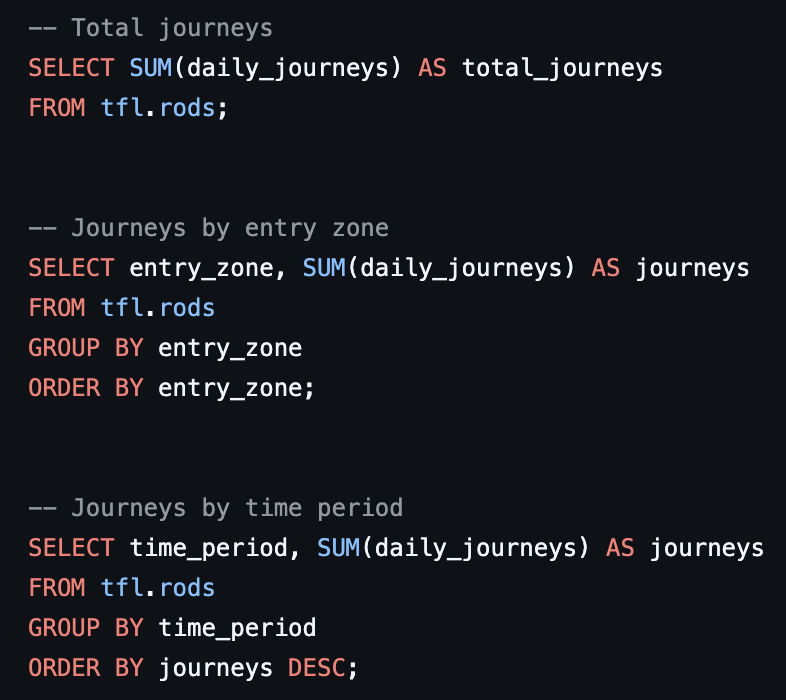
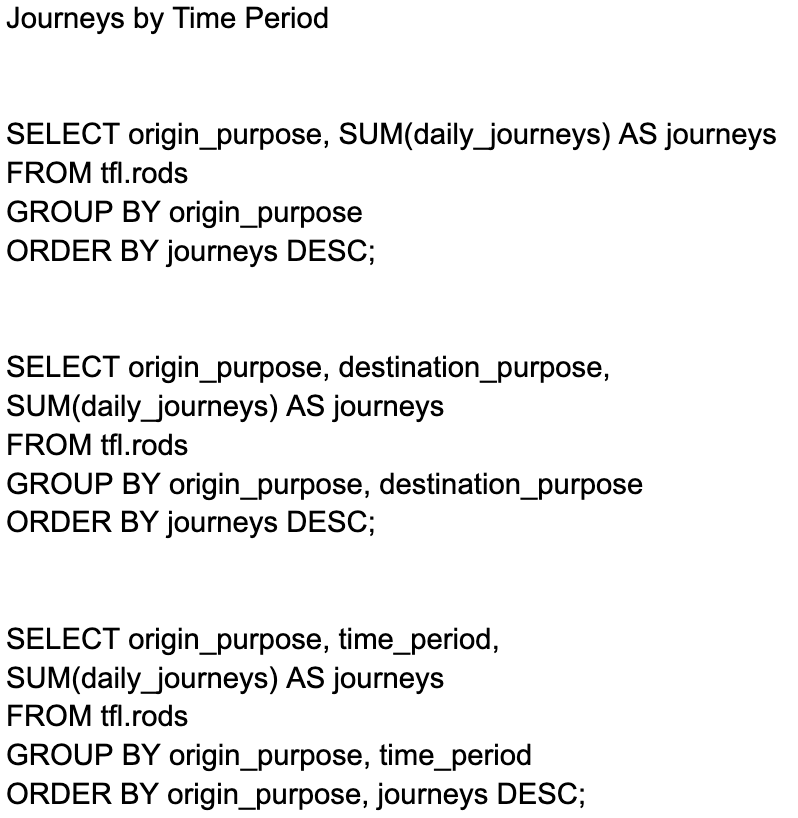
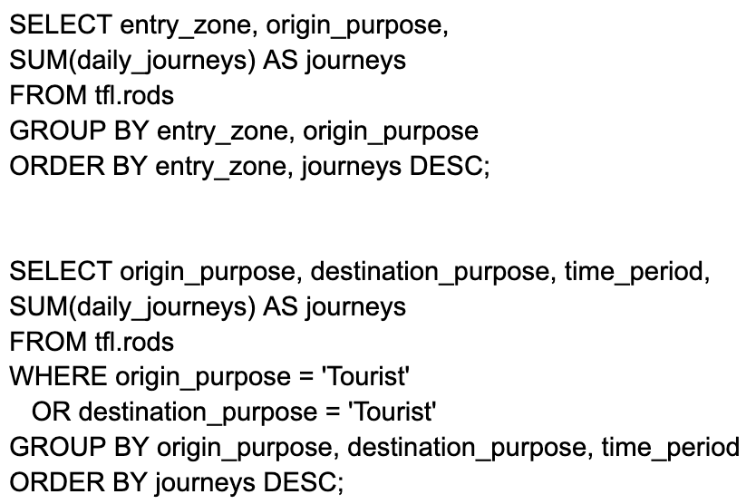

# London Transit SQL Analysis

SQL-based analysis of London Underground ridership data using the TfL RODS dataset to uncover commuter patterns and travel behavior.

---

## Overview

This project explores journey patterns across the London Underground system using SQL.  
The goal is to analyze ridership trends by zone, time period, and travel purpose to generate actionable insights for improving transit efficiency.

---

## Tools Used

- SQL
- TfL RODS Dataset
- Data Aggregation & Grouping

---

## Key Analysis

### Total Journeys
Basic aggregation of total journeys across the dataset.

---

### Journeys by Time & Zone
Breakdown of journeys by entry zones and time periods to identify peak demand.

---

### Advanced Analysis
Deeper analysis combining multiple variables such as origin, destination, and time period.

---

### Final Recommendation

Increase inbound train frequency during AM peak hours and outbound train frequency during PM peak hours to better align with commuter flow and reduce congestion across the network.

**Insight:**  
Peak congestion patterns suggest a need to increase inbound train frequency during AM peak hours and outbound frequency during PM peak hours to better align with commuter flow.

---

## Key Insights

- Peak travel demand is heavily concentrated during specific time periods
- Travel patterns vary significantly based on journey purpose
- Certain zones experience consistently higher traffic volumes
- Tourist-related journeys follow different patterns than commuter traffic

---

## Business Impact

This analysis demonstrates how SQL can be used to:
- Identify congestion patterns
- Support transportation planning decisions
- Improve resource allocation in public transit systems

---

## Project File

- `analysis.sql` — Full SQL queries used in the analysis

---

## Author

Jacob Bargeron  
Cyber Engineering Student — University of Arizona  
Aspiring Data Analyst / Cybersecurity Professional
